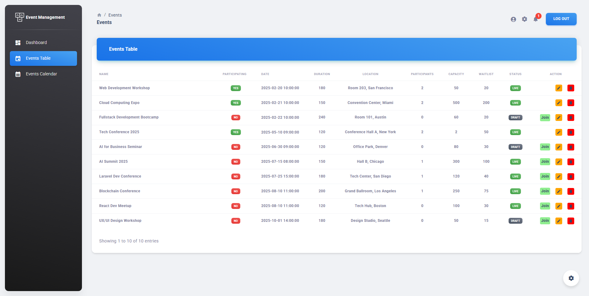
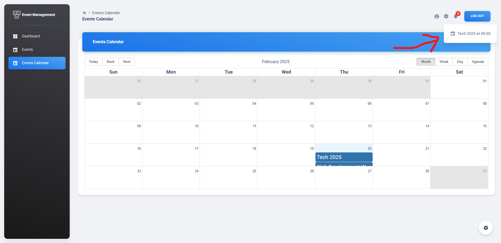
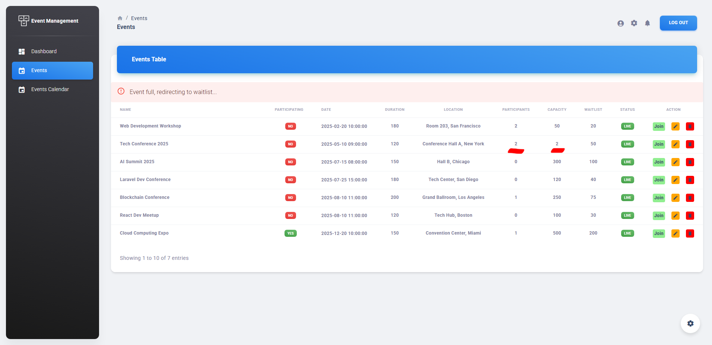
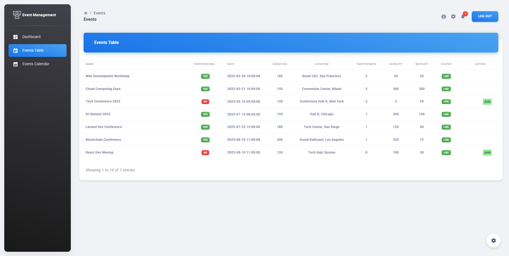
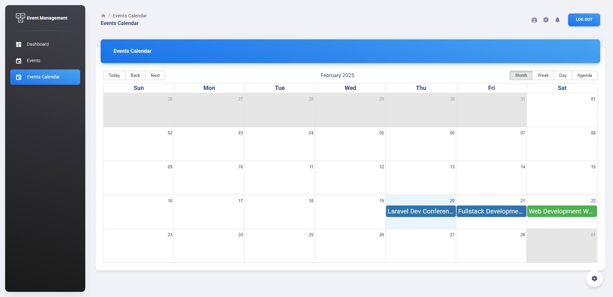

# Laravel Programming Test

## Objective

The objective of this test is to assess the ability to implement a Laravel application with user roles, event management, and scheduling constraints while leveraging Laravel Material dashboard for the admin panel and React for the frontend.

## Features

### 1. User Roles

- **Admin**: Can view all events (draft and published).
- **User**: Can view only published events.

### 2. Admin Panel 
- CRUD operations for events.

### 3. Event Management

Each event has the following attributes:

- Name
- Date & Time
- Duration
- Location
- Capacity
- Waitlist Capacity
- Live/Draft Status

### 4. User Registration & Event Participation

- User registration functionality.

- Users can join one or more events.

- Confirmation email upon successful event registration.

- Reminder notification on the day of the event.

- Users cannot join the same event twice.

- Users cannot join overlapping events on the same day.

- Capacity handling using middleware (cannot join full events).

- Waitlist functionality when an event is full.

### 5. Event Display for Users

- Admin sees all events (draft and published).

- Users see only published events in a calendar view.

- Events the user has joined are highlighted in green background.

## Laravel JSON:API Backend Installation

1. Navigate in your Laravel API project folder: `cd your-laravel-json-api-project`
2. Install project dependencies: `composer install`
3. Create a new .env file: `cp .env.example .env`
4. Add your own database credentials in the .env file in DB_DATABASE, DB_USERNAME, DB_PASSWORD
5. Create users table: `php artisan migrate --seed`
6. Generate application key: `php artisan key:generate`
7. Install Laravel Passport: `php artisan passport:install` and set in the .env file the CLIENT_ID and CLIENT_SECRET that you receive
8. Add your own mailtrap.io credentials in MAIL_USERNAME and MAIL_PASSWORD in the .env file

## Material React Frontend Installation

1. Set up your api for the project
2. Download and Install NodeJs LTS version from [NodeJs Official Page](https://nodejs.org/en/download/).
3. Navigate to the root ./ directory of the product and run `yarn install` or `npm install` to install our local dependencies.
4. Add in your projeact an .env file with the variables
 - `REACT_APP_URL=your-react-project`
 - `REACT_APP_API_URL=the-path-of-the-api`
 - `REACT_APP_IS_DEMO=false` if you don't want any restrications and true in case you want to add restrictions

## Contact

- For any issues, please reach out via mostefa.boudjema.dev\@gmail.com.

